# A COMPLETE CI/CD PROJECT WITH GITHUB ACTION WHICH DEPLOYS A JAVA APPLICATION TO KUBERNETES:

All Source codes can be found in these Repository :
 [ Banjo Babade CICD REPOsitory](https://github.com/Bjrules/CICD.git)! 
[ Banjo Babade CICD EKS Resitory](https://github.com/Bjrules/EKS-Terraform-module.git) 

## PIPELINE STAGES:  
### Compile > Security Check > Test > Build/Sonar Scan > Build and Push Docker image > Deploy to Kubernetes Repository 

This project is about a CICD pipeline which is executed on a private-Runner which is an EC2 instance in AWS which I named "banjo-host" the pipeline is triggered on push to the ‘main’ branch of the CICD Repository. The job compiles with maven ’mvn compile’ after checkingout the code  and setting up of java with version ‘17’ with each step dependent on the Previous.

 In other to implement security check, I installed and Scanned for vulnerability with Trivy and Gitleaks. I also generated reports in jason format.

Under Test, I used maven to do testing “mvn test”. I then built with maven  “mvn pakage”  *.jar and uploaded the Artifact . I scanned with SonarQube and Dis a Quality gate Check  (NB: I had install setup another EC2, installed Docker on it and run sonarqube as a Container so as to use the Configuration properties MY_SONAR_HOST_URL and MY_SONAR_TOKEN . I also configured the same for Quality Gate) 

I downloaded the uploaded Artifact, then build a Docker Image and pushed it to the Docker Registry.


To Deploy this app to kubernetes, I set up a VM EC2 where I installed kubectl (For Interaction with EKS), Terraform(for AWS EKS Module)  and aws cli( For IAM Account Authentication, credential settings)  and configured the aws cli Credentials on Github > Settings > Actions > Runner > Secrets and Variables,


NB: 
1.  I  I copied the the content of ./kube/config to set up secrets on my GitHub with the Name EKS_KUBECONFIG .

2. I had setup a security Group named (GitHubAction-Runner-sg) with Inbound Rule  for the Security Group, SMTP 465, HTTP  80, Custom TCP 3000-11000, Custom TCP 587, HTTPS 443, SSH 22.
and all the EC2 used this Security Group. " Private Runner, SonarQube Server, Kubernetes Server "

```
Some commands on My private VM Runner server:
cd actions-runner
./run.sh


Some commands on MSonarQube server:
sudo apt install docker.io 
sudo usermod -aG docker $USER               #adding ubuntu user or ec2-user to the docker usergroup
newgrp docker
docker run -d --name sonar -p 9000:9000 sonarqube:lts-community


Some commands on Kubernetes server:
#Terraform init inside EKS-Terraform Directory
terraform init
terraform plan
terraform apply --auto-approve 
aws eks –region us-east-1 update-kubeconfig –name banjo-cluster      #kubeconfig connects you from the kubernetes server to the cluster

```
## SCREENSHOTS

### Security Groups for all VMs Kindly note the inbound rules
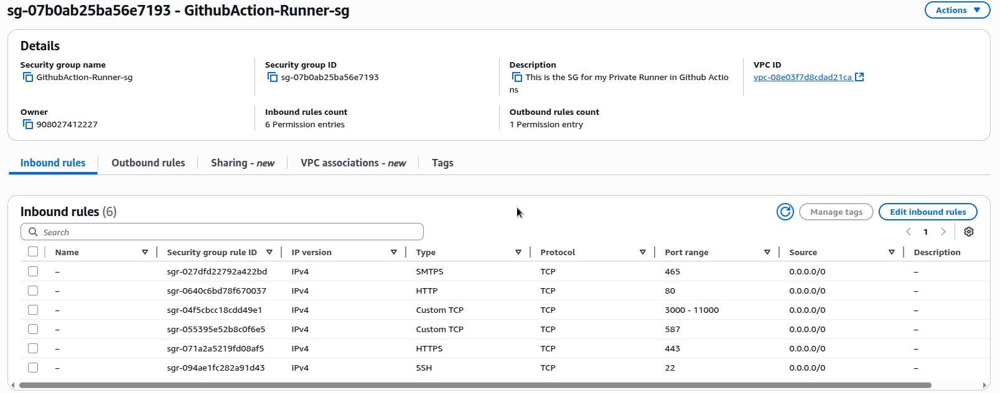

### Sonarqube Dashboard Showing Quality Gate status after sonar Scan
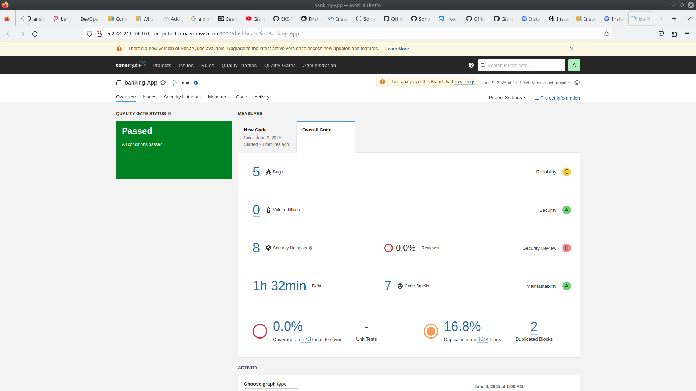

### Successfully pused to Docker Registry
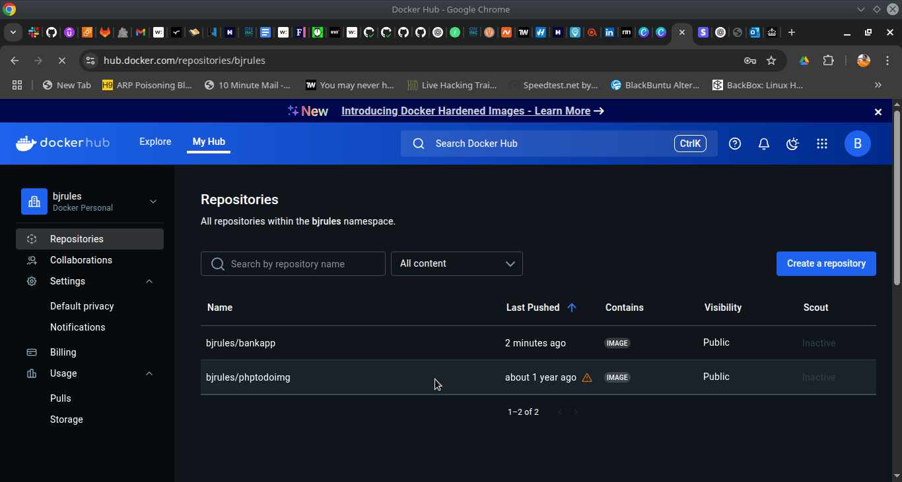

 ### Bootstrap kubernetes using the AWS EKS Module ScreenShot after Terraform Apply!
 [Terraform plan](project-screenshots/Screenshot_20250609_094715.png)
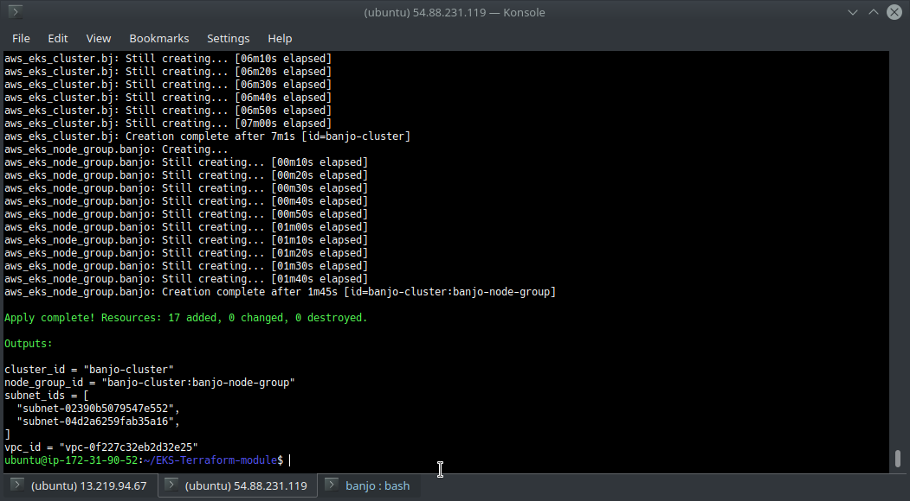


### Kubectl get nodes after the aws eks update-kubeconfig
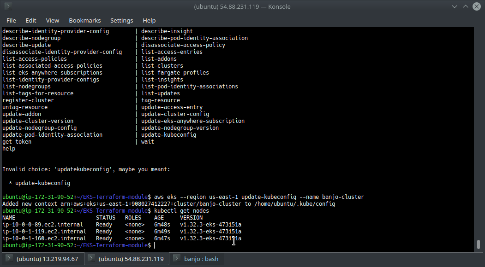

### Pipeline Completion GitHub Action Tab
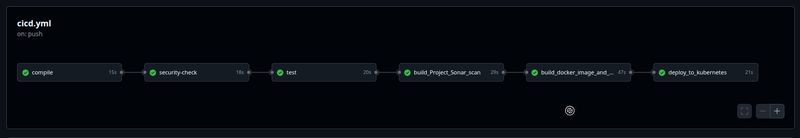

### CICD Pipeline in GitHub Actions
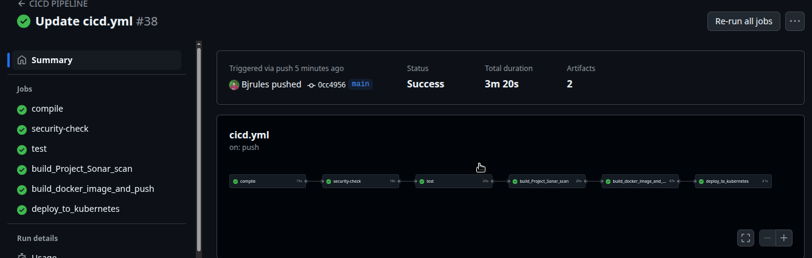

### private Runner terminal after completion
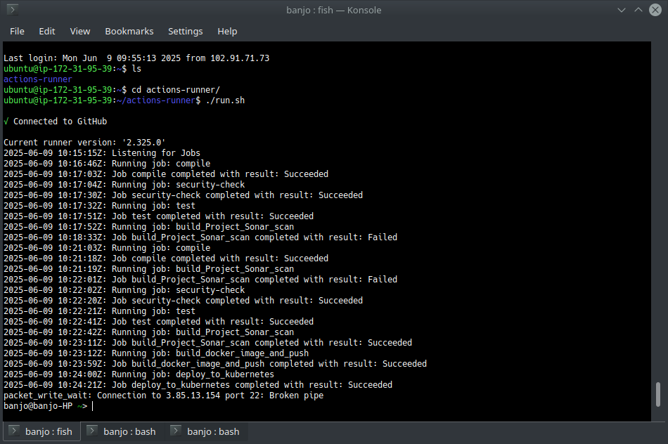

### Load Balancer DNS address display application after Deployment to kubernetes
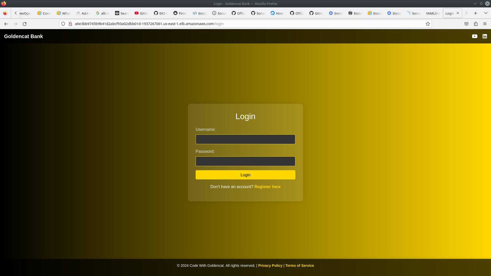

### Kubernetes Checking.  see ds.yml to see the Deplyment code
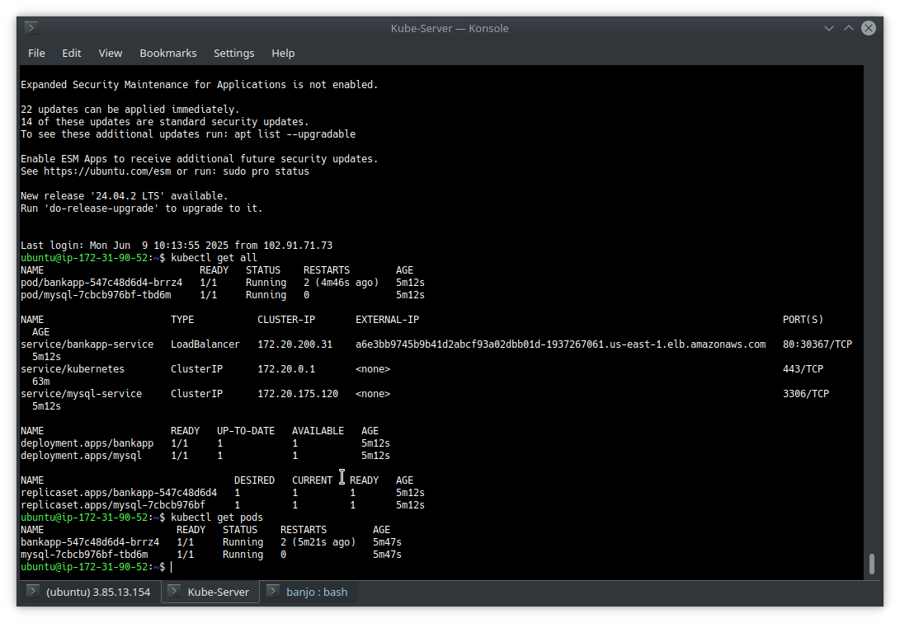

### ~/.kube/config file content copied to GitHub for Configuration
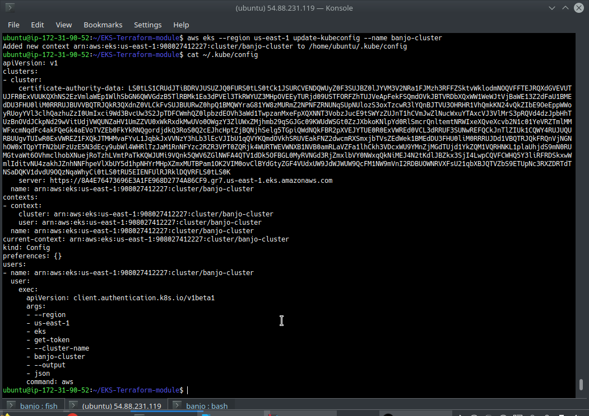


This Project was Inspired by [Aditya Jaiswal](https://github.com/jaiswaladi246/)!

### For questions, you can reach me on whatsapp +2348037871910 | Email: justbj@live.com

# Thank You !